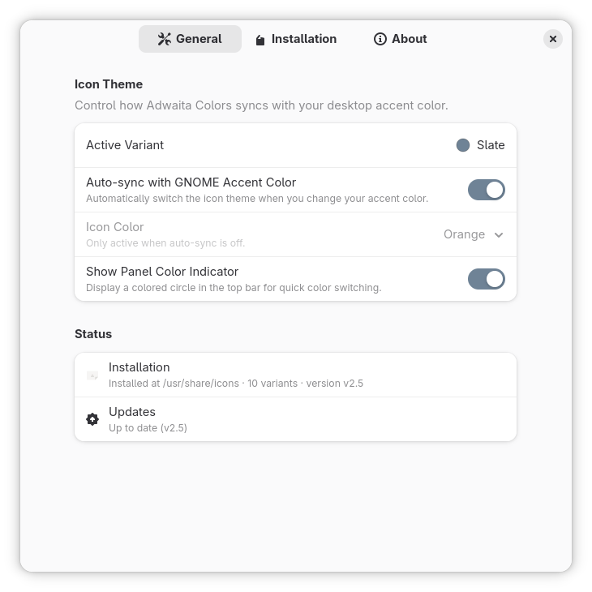
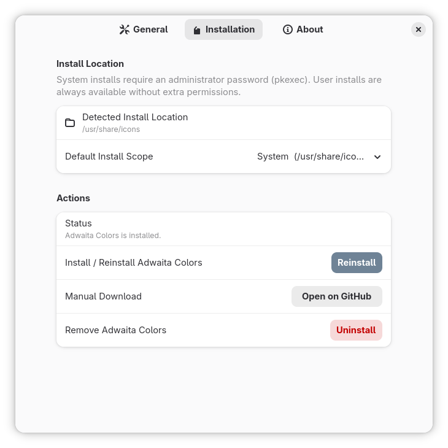
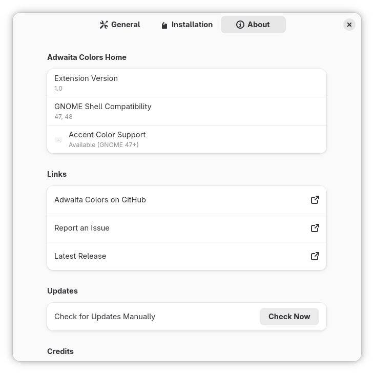

# Adwaita Colors Home

Official companion GNOME Shell extension for the [Adwaita Colors](https://github.com/dpejoh/Adwaita-colors) icon theme by **dpejoh**.

Adwaita Colors provides per-accent-color icon theme variants (`Adwaita-blue`, `Adwaita-teal`, `Adwaita-green`, …). This extension makes switching between them **automatic** by listening to your GNOME accent color setting.

---

## Features

| Feature | Description |
|---|---|
| **Auto-sync** | Icon theme changes instantly when you change your GNOME accent color (GNOME 47+) |
| **Manual picker** | Select any of the 10 color variants manually when auto-sync is off |
| **Install / Update** | Download and install Adwaita Colors directly from GitHub — no terminal needed |
| **Update checker** | Checks for new releases once per 24 hours; shows an update banner in prefs |
| **Panel indicator** | Optional colored circle in the top bar with a one-click color switcher |
| **MoreWaita integration** | Auto-patch `index.theme` to add MoreWaita to the inheritance chain |

## Screenshots

<p align="center">
	
	
	
</p>

---

## Compatibility

| Requirement | Minimum |
|---|---|
| GNOME Shell | **47** (for accent-color auto-sync) |
| libadwaita | **1.3** (for `Adw.Banner`) |
| Auto-sync | **GNOME 47+** (manual color picker works on older versions) |

> **Note:** The extension installs and loads on GNOME 47+. If your system runs an older GNOME, the auto-sync feature will be disabled and a warning will appear in preferences.

---

## Installation

### Option A — From GNOME Extensions Website
*(Once published)* Search for "Adwaita Colors Home" at [extensions.gnome.org](https://extensions.gnome.org).

### Option B — Manual Install

```bash
# 1. Clone or download this extension
git clone https://github.com/dpejoh/Adwaita-colors  # (extension will be in a subdirectory)

# 2. Copy the extension folder to your extensions directory
cp -r adwaita-colors-home@dpejoh ~/.local/share/gnome-shell/extensions/

# 3. Compile the GSettings schema
glib-compile-schemas ~/.local/share/gnome-shell/extensions/adwaita-colors-home@dpejoh/schemas/

# 4. Enable the extension
gnome-extensions enable adwaita-colors-home@dpejoh

# 5. (Optional) Restart GNOME Shell
#    On X11: Alt+F2 → type 'r' → Enter
#    On Wayland: Log out and log back in
```

---

## How Icon Theme Paths Work

The extension searches these directories (in order) for installed themes:

| Path | Notes |
|---|---|
| `~/.local/share/icons` | **User install** — recommended, no root needed |
| `~/.icons` | Legacy user path |
| `/usr/local/share/icons` | Standard local system path |
| `/var/usrlocal/share/icons` | **Atomic desktops** (Silverblue, Kinoite) — persists across OS updates |
| `/usr/share/icons` | System-wide, usually read-only |

On **atomic/ostree desktops** (Fedora Silverblue, Kinoite, uBlue variants):
- `/usr/local` is a symlink to `/var/usrlocal`
- `/var/usrlocal` survives ostree updates — so it is the correct persistent system path
- The extension detects atomic desktops automatically via `/run/ostree-booted`
- **User install is recommended** on atomic desktops

---

## Accent Color Mapping

| GNOME Accent | Adwaita Colors Theme |
|---|---|
| Blue (default) | `Adwaita-blue` |
| Teal | `Adwaita-teal` |
| Green | `Adwaita-green` |
| Yellow | `Adwaita-yellow` |
| Orange | `Adwaita-orange` |
| Red | `Adwaita-red` |
| Pink | `Adwaita-pink` |
| Purple | `Adwaita-purple` |
| Slate | `Adwaita-slate` |
| — | `Adwaita-brown` *(manual only — no GNOME accent equivalent)* |

---

## Conflict with `auto-adwaita-colors@celiopy`

If the legacy community extension `auto-adwaita-colors@celiopy` is enabled at the same time, both extensions will race to set `org.gnome.desktop.interface icon-theme`. The extension detects this on startup and shows a notification. **Disable the legacy extension** to avoid conflicts.

---

## MoreWaita Integration

If the [MoreWaita](https://github.com/somepaulo/MoreWaita) icon theme is installed, the extension offers to patch each Adwaita Colors `index.theme` file to add MoreWaita to the inheritance chain:

```ini
# Before patch:
Inherits=Adwaita,AdwaitaLegacy,hicolor

# After patch:
Inherits=MoreWaita,Adwaita,AdwaitaLegacy,hicolor
```

This gives you the extended icon coverage of MoreWaita while keeping the Adwaita Colors accent color overrides.

---

## GSettings Keys

| Key | Type | Default | Description |
|---|---|---|---|
| `auto-sync` | boolean | `true` | Sync icon theme with accent color automatically |
| `manual-color` | string | `'blue'` | Manually selected color when auto-sync is off |
| `install-scope` | string | `'user'` | `'user'` or `'system'` |
| `installed-version` | string | `''` | Version tag of installed theme (e.g. `v2.4.0`) |
| `last-update-check` | int64 | `0` | Unix timestamp of last update check |
| `skipped-version` | string | `''` | Version to suppress update notifications for |
| `show-panel-indicator` | boolean | `false` | Show colored circle in top bar |
| `custom-install-path` | string | `''` | Override default install path |

---

## License

GPL-3.0-or-later — same license as GNOME Shell itself.

---

## Credits

- **Adwaita Colors icon theme** — [dpejoh](https://github.com/dpejoh/Adwaita-colors)
- **Extension** — developed as the official companion to the theme project
